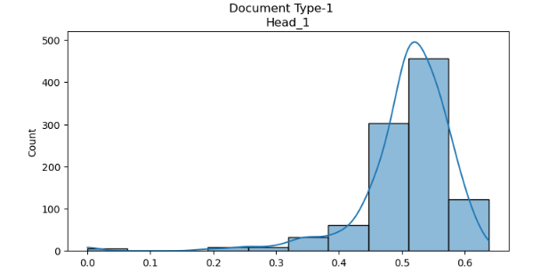
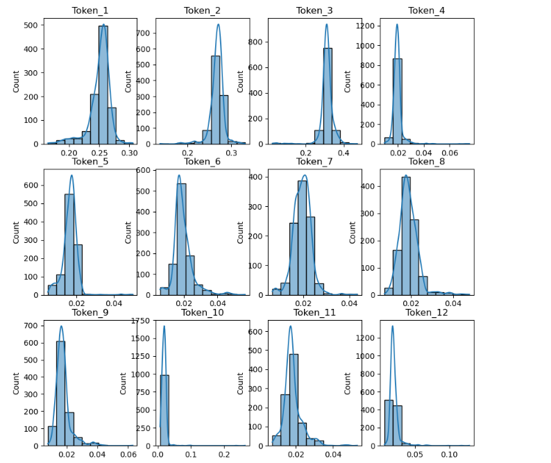
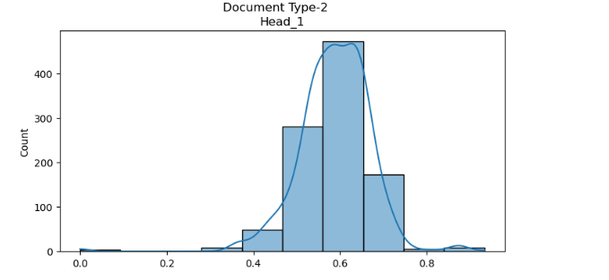
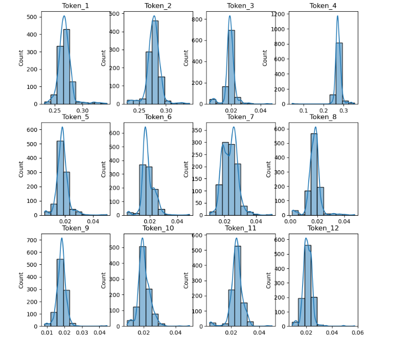

Consider the following setting
- Total no of tokens - 12
- Base document type has 2 high probability token 
- Each document type has one more high probability token, which is unique for the document type

  

  Now we consider a gpt model with 64 dimension and different layers and heads, trained using ADAMW optimizer

  - 1-head 1-layer, training-loss 1.744
  - document accuracy for 5 generated runs

|  seed |  accuracy  |
| ----  | ---------  |
| 0 | 83.5 |
| 1 | 86 |
| 2 | 81.5 |
| 3 | 87.5 |
| 4 |  85.5 |

- Attention and Logits distribution

 
 
 
 
 

  

  
